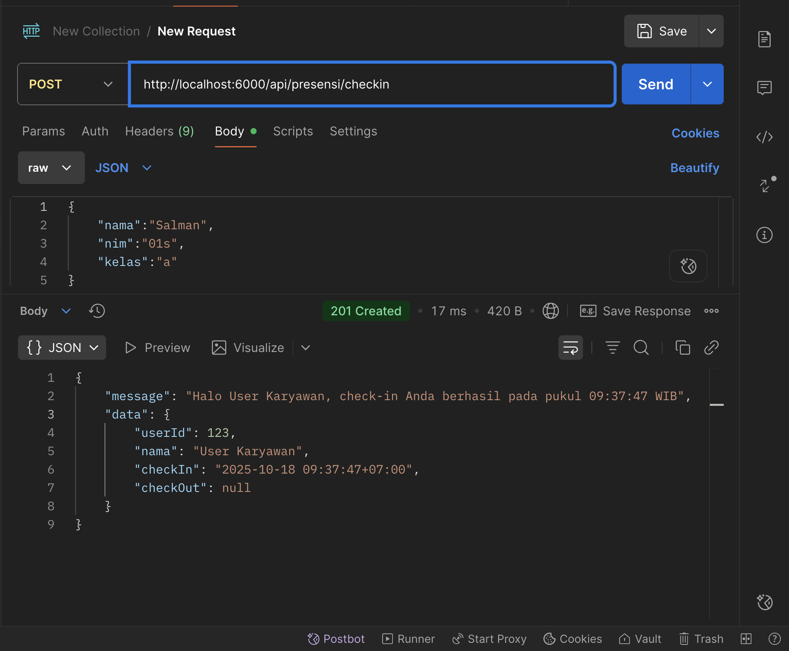
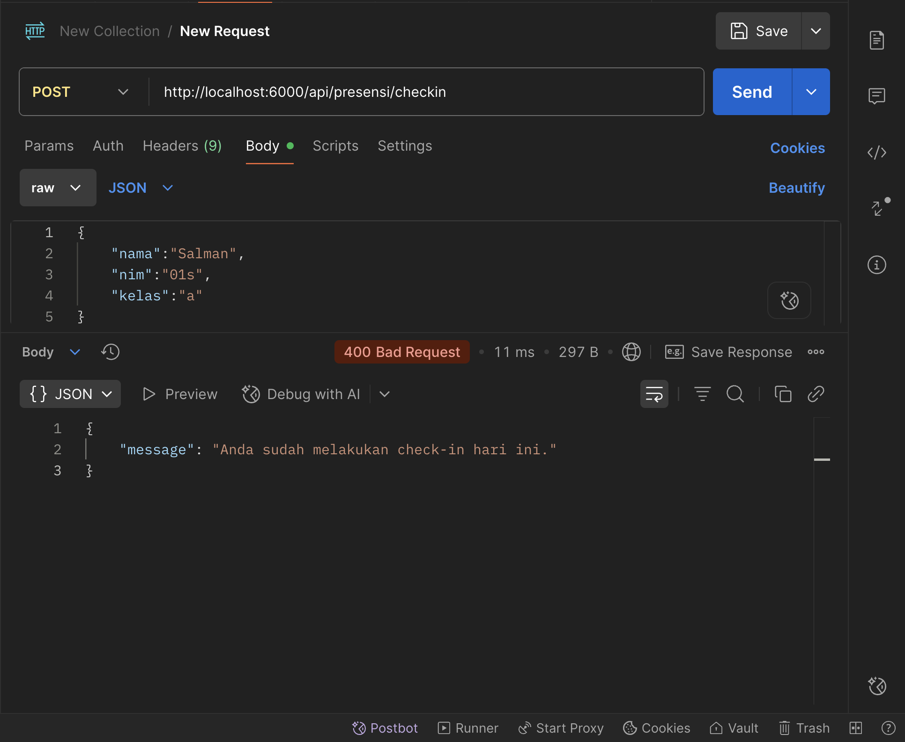
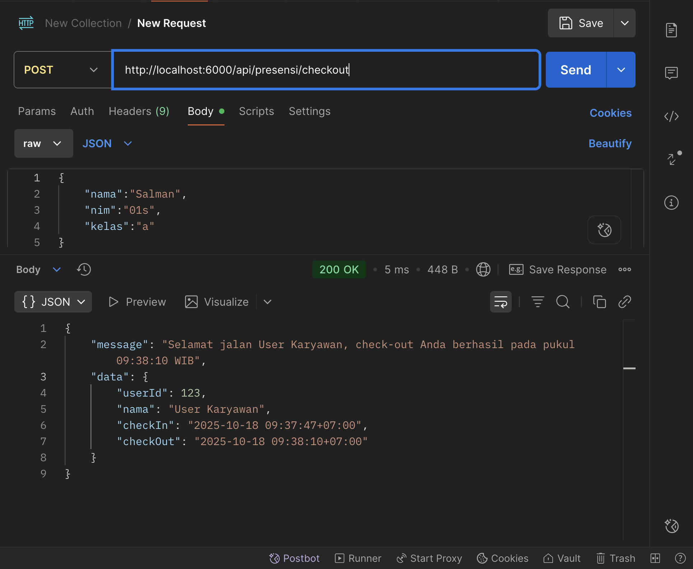
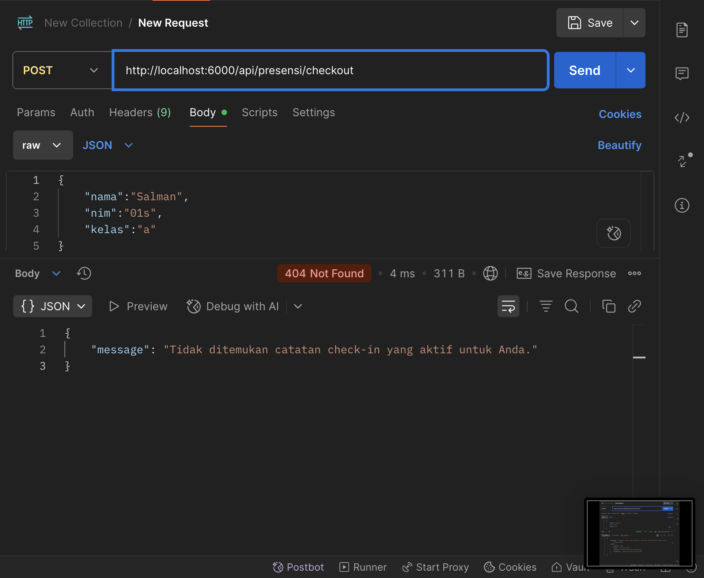
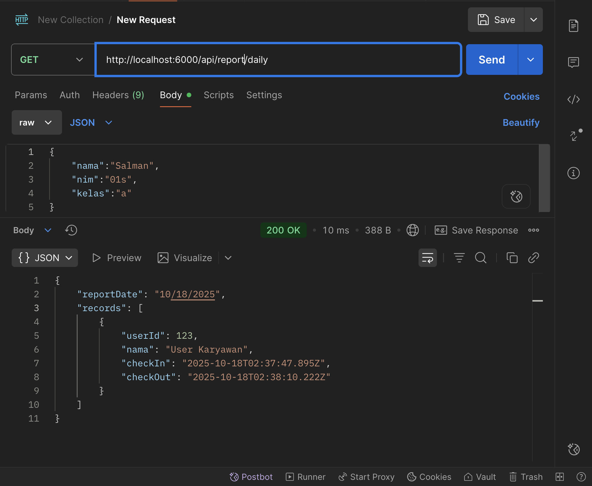

MENAMPILKAN END POINT CHECK-IN

MENAMPILKAN END POINT CHECK-IN JIKA LEBIH DARI SATU KALI

MENAMPILKAN END POINT CHECK-OUT

MENAMPILKAN END POINT CHECK-OUT JIKA BELUM CHECK-IN

MENAMPILKAN REPORT'S
